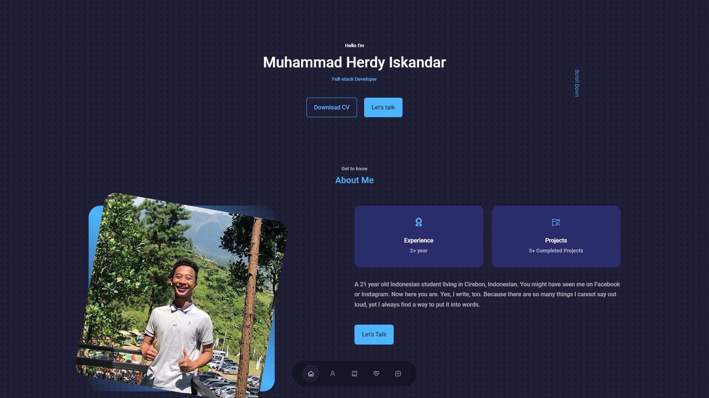

# Personal-Portfolio
> This is personal portfolio website.



## Built With

- React
- CSS
- VS code

## Live Demo

- [Live Demo](https://dyzulk.com/)


# Getting Started
## Prerequisites:


- Create an account on github

- Install gitbash or use git on the command line.

- Use an IDE of your preference such as VScode.

## Steps to follow:

- Choose a folder in your local machine where you want this repository to be copied

- Clone this [repository](https://github.com/dyzulk/react-portofolio) to your local machine 
- ```
  git clone https://github.com/dyzulk/react-portofolio.git
  ```

- Navigate to `cd react-portofolio`  directory.

- To install all the app dependencies on the command line run
- ```
  npm install
  ``` 
- To run app in the development mode run 
- ```
  npm start
  ```


## Author

:woman: **Herdy Iskandar**

- [GitHub](https://github.com/dyzulk)
- [LinkedIn](https://www.linkedin.com/in/dyzulk/)

## 🤝 Contributing
- Contributions, issues, and feature requests are welcome!
- Feel free to check the [issues page](https://github.com/dyzulk/react-portofolio/issues).

# Show your support
Give a ⭐ if you like this project!

# react-portofolio
